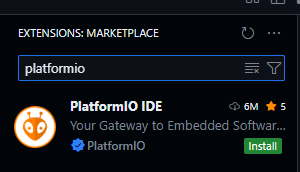
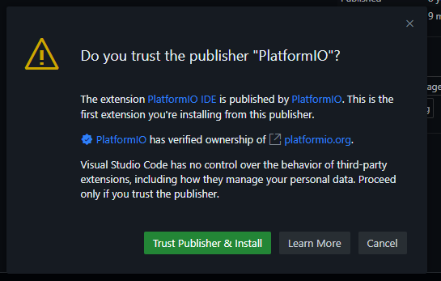
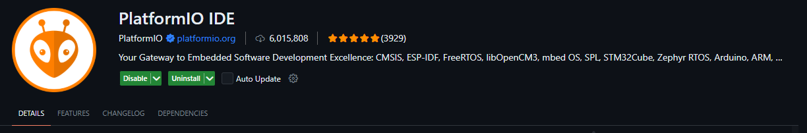

## Cài đặt PlatformIO

### Hướng dẫn

Vào **Extensions: MARKETPLACE**, tìm `platformio`



Chọn `Install`, chọn `Trust ...` nếu có.





### Khởi tạo dự án thông qua tập tin `platformio.ini`

Bên dưới là một ví dụ mẫu của `platformio.ini`:

```
; PlatformIO Project Configuration File
;
;   Build options: build flags, source filter
;   Upload options: custom upload port, speed and extra flags
;   Library options: dependencies, extra library storages
;   Advanced options: extra scripting
;
; Please visit documentation for the other options and examples
; https://docs.platformio.org/page/projectconf.html

; env name also the name of build folder in .pio/build/
[env:esp32dev]
; platform
platform = espressif32                                              ; chọn nền tảng (ví dụ: ESP32)
; board
board = esp32dev                                                    ; chọn loại bo mạch (ví dụ: ESP32 DevKit)
; framework, although board is esp
; i will use arduino framework for easier of code :>
framework = arduino                                                 ; chọn framework (Arduino, ESP-IDF, v.v.)
; dependancies
lib_deps = 
	; for DHT sonsor
	adafruit/DHT sensor library@^1.4.6 
	adafruit/Adafruit Unified Sensor@^1.1.14
	; for Firebase
	mobizt/Firebase ESP32 Client@^4.4.14

; for "Serial" comunication (default baud_rate=9600);
; can be erased
monitor_speed = 115200                                              ; tốc độ Serial Monitor
; for upload firmware to board, can be erased
upload_speed = 921600                                               
upload_port = /dev/ttyUSB0                                          ; cổng nạp (có thể bỏ qua để tự động dò)
;
```

### Giới thiệu sơ về `platformio.ini`

Tham khảo: [“platformio.ini” (Project Configuration File)](https://docs.platformio.org/en/latest/projectconf/index.html#projectconf)


## Khởi tạo dự án

Để khởi tạo nhanh,

1. Mở thư mục trên VSCode (Open folder).
2. Tạo file **platformio.ini**
3. Mở file platformio.ini, và thực hiện theo các hướng dẫn. 
3.1. Nếu platformio không khởi chạy, hãy nhấn vào biểu tượng của platformio trên thanh ``Side bar``