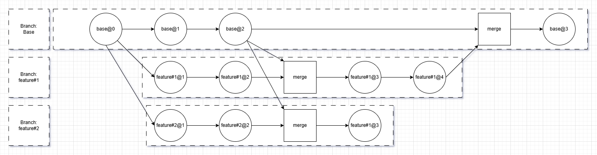
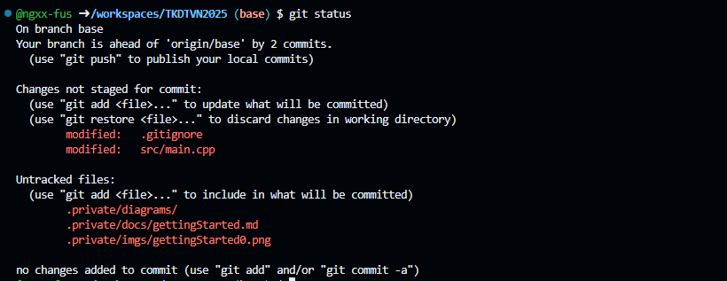
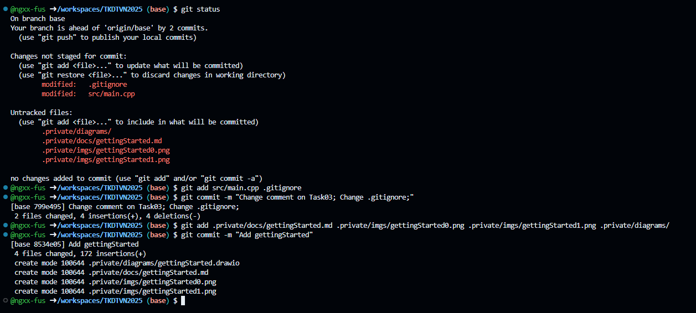
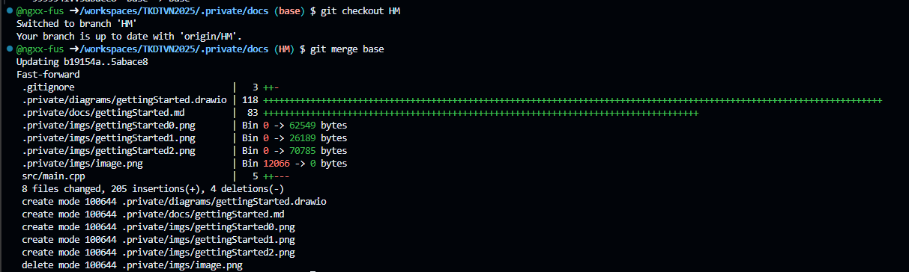
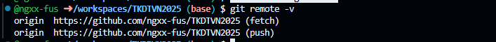
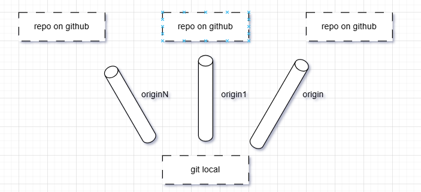
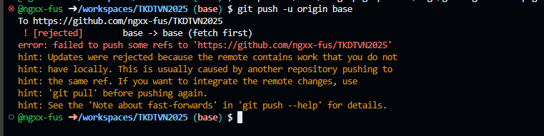
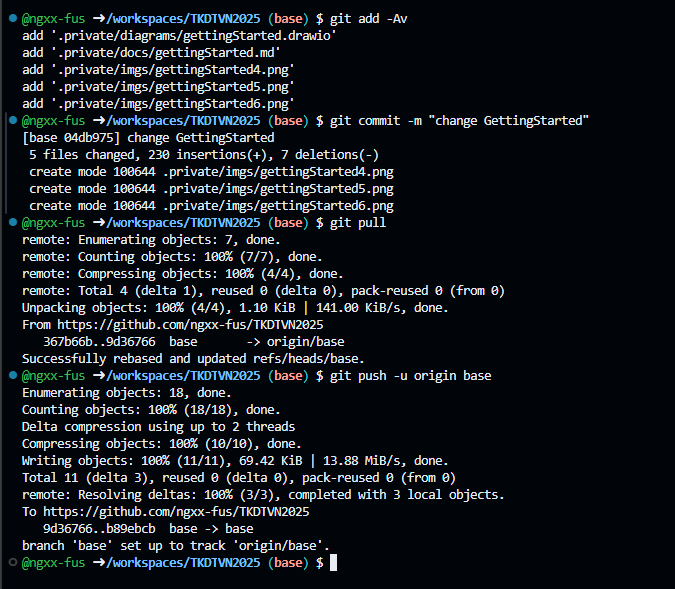

# Working with git 

## Git basic


### Git? GitHub?

- Git – A version control system that tracks changes in your code and allows you to manage different versions of a project locally.

- GitHub – A cloud-based platform that hosts Git repositories, making it easy to collaborate, share, and back up your projects online.

### Commit?

Commit – A snapshot of your changes in the repository. Each commit represents a saved point in your project’s history.

### Branch?

Branch – A separate line of development. You can create branches to work on new features or fixes without affecting the main code.

### Commit - A recovery point for your code

A commit is represented by a node. The child of a node meaning the commit make from changed parent state (parent commit) of your code. For working together, people start from a base source (also called base version), then a person develop a feature. Until you need to combine (merge) all feature into a product.

The chart below show how we work with git:



Sometime, We may merge some feature back to base.

### Understand your git

#### See what have changed

```
git status
```
Result:


Description:

- `On branch base` : You’re currently on the `base` branch.
- `Your branch is ahead of 'origin/base' by 2 commits.` : You have two local commits that haven’t been pushed to GitHub yet.
- `Changes not staged for commit:` : These are tracked files that have been modified but not added to the next commit.
- `Untracked files:` : These are new files not yet tracked by Git. You may have just created or added them.

#### Commit what's changed

Add specific files to the next commit:

```
git add <files that you want to commit>
```

Add all changed and untracked files:

```
git add -Av 
```

Then create a commit with a short message:

```
git commit -m <Short mesage>
```

Or open the default editor to write a detailed commit message:

```
git commit 
```

Result:



#### Merge - Update your code

You can merge changes from one branch into another using the git merge command.

```
git checkout <dest branch name>
git merge <src branch name>
```

Result:


Fast-forward merge means:
- There were no conflicting changes between the two branches.
- Git simply moved the branch pointer (HM) forward to match the latest commit from base.
- No new merge commit was created — it’s a clean, automatic update.

#### Pull/Fetch - Sync your code

**fetch**
Keep your local repository up to date with the remote one using git fetch or git pull.
```
git fetch
```

**pull**
```
git pull
```

Runs git fetch and then automatically merges the latest changes into your current branch.


### Remote - Upstream

A remote in Git is a reference to a repository hosted elsewhere (usually on GitHub, GitLab, or another server). It allows you to synchronize your local repository with others.

Check existing remotes:
```
git remote -v
```

Result:


**Notice that:** You also can have many remotes. The image be below illustrate the remote:



**Sometime**, you need to specify the remote to execute `push` or `pull` command.

```
git push -u <remote name ?> <branch name?>
git pull    <remote name ?> <branch name?>
```

Example:
```
git push -u origin base
git pull origin base
```

You can create new remote via command below:
```
git remote add <remote/upstream name; usually: origin> <repository URL>
```

### Push your code

After committing your changes locally, you can upload (push) them to the remote repository on GitHub.

```
git push
```

or with specified upstream or in first time push:
```
git push -u <remote name ?> <branch name?>
```

### Jump between branches

Switch to another branch using:
```
git checkout <dest branch name>
```
Explanation:
- Moves your working directory to the specified branch.
- Updates your files to match that branch’s latest commit.
- Any uncommitted changes will stay, but may cause conflicts if they affect the same files.

**Newer Alternative (Recommended):**
```
git switch <branch-name>
```
```git switch``` is a clearer, modern command introduced in newer Git versions. It works just like git checkout for switching branches, but is easier to understand.

### Conflicts - Unavoidable
 
The part above shows an ideal workflow. In real life, it’s much more complicated. If a node (a state or commit) has two child nodes with similar changes in different branches, then when you merge those branches, a conflict is very likely to occur. Simply put, if you merge two commits that modify the same lines or positions in the code, a conflict will occur.

**Scenario**: You have edited the repository directly on GitHub. Later, when you return to your local environment, your local branch is not yet synchronized (you forgot to run git pull). After making many new changes locally, you try to push them back to GitHub — but since the remote version has also changed, a conflict occurs. The image below illustrates this scenario.



Solution:
1. Commit your current changes
```
git add -Av
git commit -m "Save local work before sync"
```
2. Pull changes from remote + rebase (auto); If failed, you will manually merge.
```
git pull --rebase
```
. This keeps your commit history clean by placing your changes on top of the updated remote branch.
. If rebase fails due to conflicts, Git will pause and let you manually resolve them.
3. After resolving all conflicts, continue rebase
```
git rebase --continue
```
4. Finally, push your changes
```
git push
```



**Tip:** If you prefer to merge instead of rebase:
```
git pull --no-rebase
```
But this will create an extra merge commit in your history.
